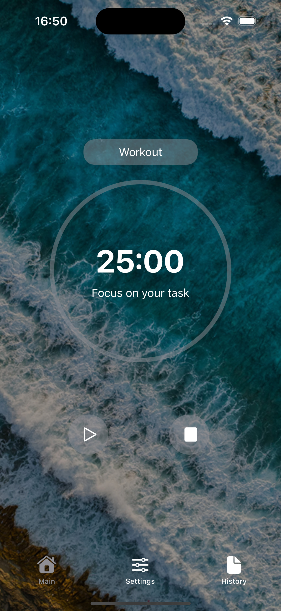
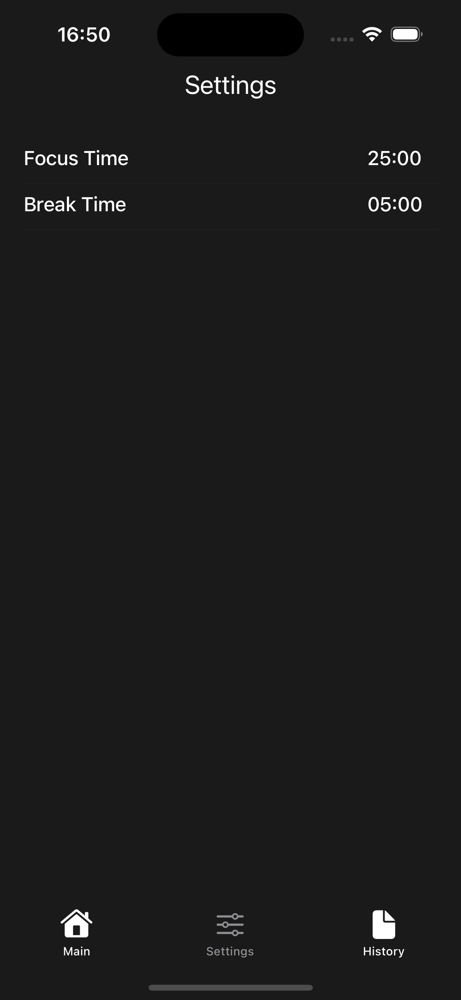
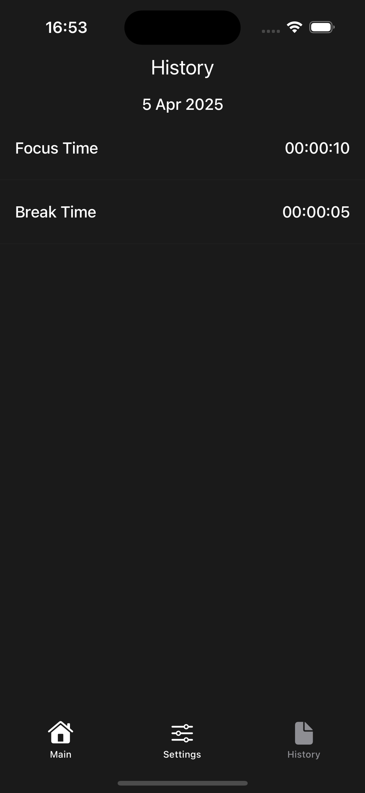

# ⏱️ Pomodoro Timer App

A beautifully designed and customizable Pomodoro Timer iOS application built with SwiftUI. This app helps users maintain focus and productivity through structured work and break sessions, based on the proven Pomodoro Technique.

> 

## 🚀 Features

### ✅ Core Functionality
- **Focus & Break Timer**: Automatically alternates between focus and break periods.
- **Session States**: Handles running, paused, and completed timer states.
- **Visual Timer**: Circular progress view with animated updates and formatted time remaining.

### 🎯 Category Customization
- **Focus Categories**: Choose from multiple built-in focus categories (Work, Study, Workout, Reading, Meditation, Others).
- **Category Selector Sheet**: User-friendly modal to select and switch categories.

### 📊 Session Management
- **PomodoroSession Model**: Stores session data such as elapsed time, focus/break durations, and timer state.
- **Cycle Handling**: Automatically transitions between focus and break cycles when time elapses.

### 🧠 ViewModel Architecture
- **MVVM Pattern**: Clean separation of UI and logic via `PomodoroTimerViewModel`.
- **Background Support**: Timer runs in background using `UIBackgroundTaskIdentifier`.

### 🖼️ UI & UX
- **Main Screen**: Includes timer, current category, and intuitive controls (start, pause/resume, stop).
- **Category Sheet View**: Smooth transition and layout using `LazyVGrid`.
- **Reusable Components**: Modular UI elements like `TimerButton` for consistency.

### 🛠️ Future Enhancements (Planned)
- **Settings Panel**: Customize sound, notifications, and themes.
- **History Tracking**: Log daily session times (focus and break) via `DailyHistory` struct.
- **Data Persistence**: Store user settings and history using `UserDefaults` or `CoreData`.

## 🧱 Tech Stack

- **Language**: Swift
- **Frameworks**: SwiftUI, UIKit (for background tasks)
- **Architecture**: MVVM (Model-View-ViewModel)
- **Deployment**: iOS

## 📁 Project Structure

- `MainView.swift` – Main timer UI.
- `PomodoroTimerViewModel.swift` – ViewModel with business logic and timer lifecycle.
- `PomodoroSession.swift` – Session data structure and timer state.
- `CategorySheetView.swift` – Modal sheet to choose focus categories.
- `TimerButton.swift` – Reusable button component.
- `ContentView.swift` – Main TabView entry point.
- `SettingsView.swift` – Placeholder for settings.
- `HistoryView.swift` – Placeholder for session history.
- `DailyHistory.swift` – Data model for tracking daily time.

### 📸 Preview

| Main Tab | Settings Tab | History Tab |
|------------|--------------------|----------------|
|  |  |  |
---

### 📌 Getting Started

1. Clone the repository.
2. Open in Xcode.
3. Run on simulator or device.
4. Focus, relax, and repeat 🍅.

